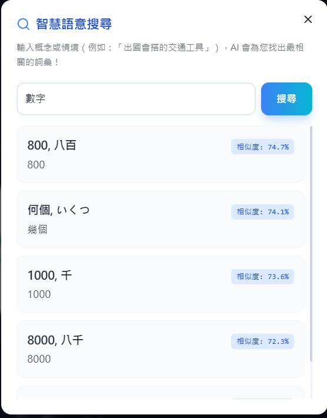
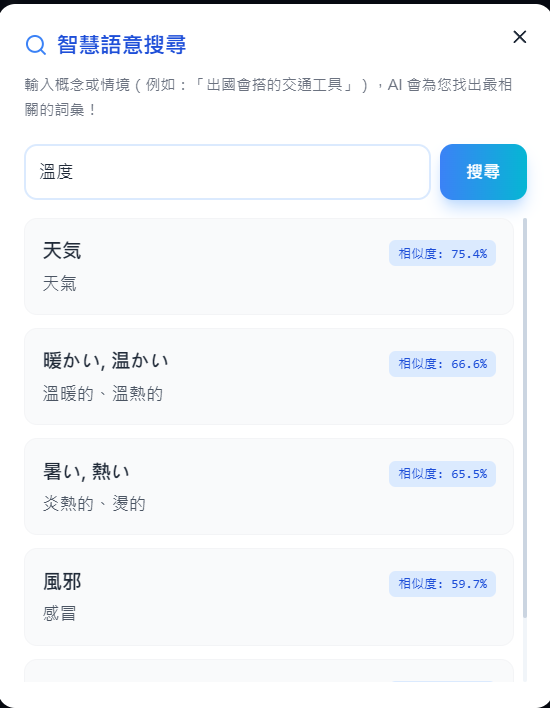
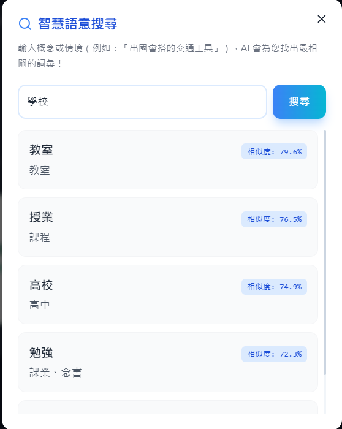

# 🇯🇵 日文課打字練習系統 - 運作與維護手冊
demo影片:https://youtu.be/kcAQxJzotYs

> **🎉 本專案已成功部署至線上！**
> 點擊此處立即體驗免安裝的網頁版：[https://moemuom9488m.github.io/japanese-typing-practice/](https://moemuom9488m.github.io/japanese-typing-practice/)

本專案已全面 Docker 化，你可以輕鬆地透過 Docker 進行開發與部署。為了方便管理，我們推薦使用專用的 Jupyter Notebook (`.ipynb`) 來作為控制台。

## 🚀 快速啟動 (使用 Jupyter Notebook)

我們提供了一個 `SystemControl.ipynb` 檔案。你只需要在 VS Code 中打開它，並點擊每個儲存格左側的「播放」按鈕即可執行對應操作：

1. **啟動系統**：自動建置並開啟容器。
2. **系統維護**：安裝新的 npm 套件或查看日誌。
3. **關閉系統**：安全停止並移除容器。

---

## 🛠️ Docker 指令說明 (手動模式)

如果你偏好使用終端機 (Terminal)，請參考以下指令：

### 1. 啟動服務 (Start)
```powershell
docker compose up -d --build
```
*   `-d`: 於背景執行。
*   `--build`: 強制重新建置（當你修改了 `Dockerfile` 或 `package.json` 時必用）。
*   啟動後請訪問：`http://localhost:5173`

### 2. 系統維護 (Maintenance)
*   **查看即時日誌**：
    ```powershell
    docker compose logs -f
    ```
*   **同步 npm 套件到本地 (供編輯器補全用)**：
    ```powershell
    docker run --rm -v ${PWD}:/app -w /app node:20 npm install
    ```

### 3. 關閉服務 (Stop)
```powershell
docker compose down
```

### 4. 設定外部 IP / 區域網路存取
目前的設定已預設支援區域網路存取 (`--host`)。
*   **確認你的 IP**：在 CMD 輸入 `ipconfig` 找到你的 IPv4 地址（例如 `192.168.1.10`）。
*   **外部存取**：同網域的其他裝置可透過 `http://你的IP:5173` 進行連線練習。

---

## 📂 目錄結構
*   `src/App.jsx`: 核心 React 邏輯與介面。
*   `src/data.js`: 題目資料庫與課程設定。
*   `Dockerfile` & `docker-compose.yml`: 環境配置。
*   `backup/`: 存放舊版的單體備份檔案。

---

## 🔍 智慧語意搜尋 (Vector Database)
本系統支援基於 **Hugging Face (`Transformers.js`)** 與 **本機 GPU 預運算** 的零伺服器語意搜尋架構。

### 功能展示
以下是幾張實際在前端無伺服器架構下進行語意搜尋的展示截圖：

<div style="display: flex; gap: 10px; flex-wrap: wrap;">
  <!-- 請將截圖命名為對應名稱並放入 public/ 目錄下即可 -->
  
  
  
  
</div>

### 如何生成語意向量？
若您修改了 `src/data.js` 的題庫，請依序執行以下步驟來更新向量資料庫：

1. **匯出最新題庫**：在終端機執行 `node scripts/export_json.js`，這會在目錄產生 `raw_data.json`。
2. **啟動本機 GPU 計算**：確保您在具有 CUDA 支援的 Python/Conda 環境 (如 `pytorch` 虛擬環境)，並執行：
   ```powershell
   python scripts/generate_embeddings.py
   ```
   這會自動下載並使用 `MiniLM-L12-v2` 模型將 `raw_data.json` 轉為 `quiz_with_embeddings.json`。
3. **完成**：重新啟動或重新整理網頁即可享有最新的語意搜尋功能！

---

## ⚠️ 注意事項
*   修改 `src/data.js` 後，Vite 會自動熱更新，無需重新啟動 Docker。
*   若修改了 `package.json` 的依賴項，請執行 `docker compose up --build` 重新編譯鏡像。
*   **線上版本 (GitHub Pages) 不會自動更新**：若要將本機最新的修改推送到線上版本（即更新 `gh-pages` 分支），請手動在終端機執行 `npm run deploy` 進行建置與發布。

---

## ⚖️ 免責聲明 (Disclaimer)
> [!NOTE]
> The vocabulary and sentence data used in this project are for educational and personal practice purposes only. All rights to the original content belong to the publisher of **"就是要學日本語 初級（上）"**.
